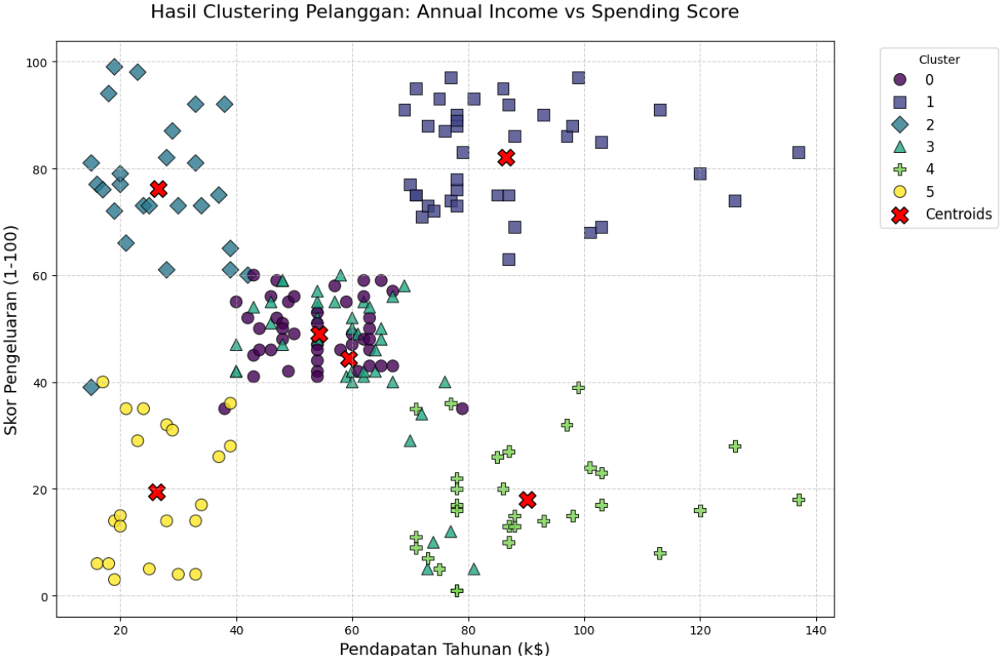

# mall-customer-segmentation

## Deskripsi Projek
Projek ini bertujuan untuk melakukan **segmentasi pelanggan** dari sebuah mall berdasarkan karakteristik seperti usia, pendapatan tahunan, dan skor pengeluaran. Segmentasi dilakukan menggunakan algoritma **K-Means Clustering** untuk mengelompokkan pelanggan ke dalam beberapa cluster yang memiliki karakteristik serupa. Hasil segmentasi ini dapat digunakan untuk merancang strategi pemasaran yang lebih efektif.

## Dataset
Dataset yang digunakan adalah **Mall Customer Segmentation Data** dari [Kaggle](https://www.kaggle.com/vjchoudhary7/customer-segmentation-tutorial-in-python). Dataset ini terdiri dari 200 baris dan 5 kolom:
- `CustomerID`: Nomor identifikasi pelanggan.
- `Gender`: Jenis kelamin pelanggan (Male/Female).
- `Age`: Usia pelanggan.
- `Annual Income (k$)`: Pendapatan tahunan pelanggan (dalam ribuan dolar).
- `Spending Score (1-100)`: Skor pengeluaran pelanggan (1 = rendah, 100 = tinggi).

## Langkah-Langkah Analisis
1. **Exploratory Data Analysis (EDA)**:
   - Analisis statistik deskriptif.
   - Visualisasi distribusi variabel numerik dan kategorik.
   - Pengecekan korelasi antar variabel.
2. **Data Preprocessing**:
   - Scaling variabel numerik menggunakan StandardScaler.
3. **Clustering**:
   - Menentukan jumlah cluster optimal menggunakan Elbow Method dan Silhouette Score.
   - Melakukan clustering menggunakan algoritma K-Means.
4. **Visualisasi Hasil**:
   - Visualisasi hasil clustering menggunakan scatter plot.
   - Interpretasi setiap cluster berdasarkan karakteristik pelanggan.
   - 

## Hasil Clustering
Berdasarkan analisis, pelanggan dapat dikelompokkan menjadi **6 cluster**:
1. **Cluster 0**: Pelanggan dengan pendapatan menengah dan skor pengeluaran menengah.
2. **Cluster 1**: Pelanggan dengan pendapatan tinggi dan skor pengeluaran tinggi.
3. **Cluster 2**: Pelanggan dengan pendapatan rendah dan skor pengeluaran tinggi.
4. **Cluster 3**: Pelanggan dengan pendapatan tinggi dan skor pengeluaran menengah.
5. **Cluster 4**: Pelanggan dengan pendapatan tinggi dan skor pengeluaran rendah.
6. **Cluster 5**: Pelanggan dengan pendapatan rendah dan skor pengeluaran rendah.
